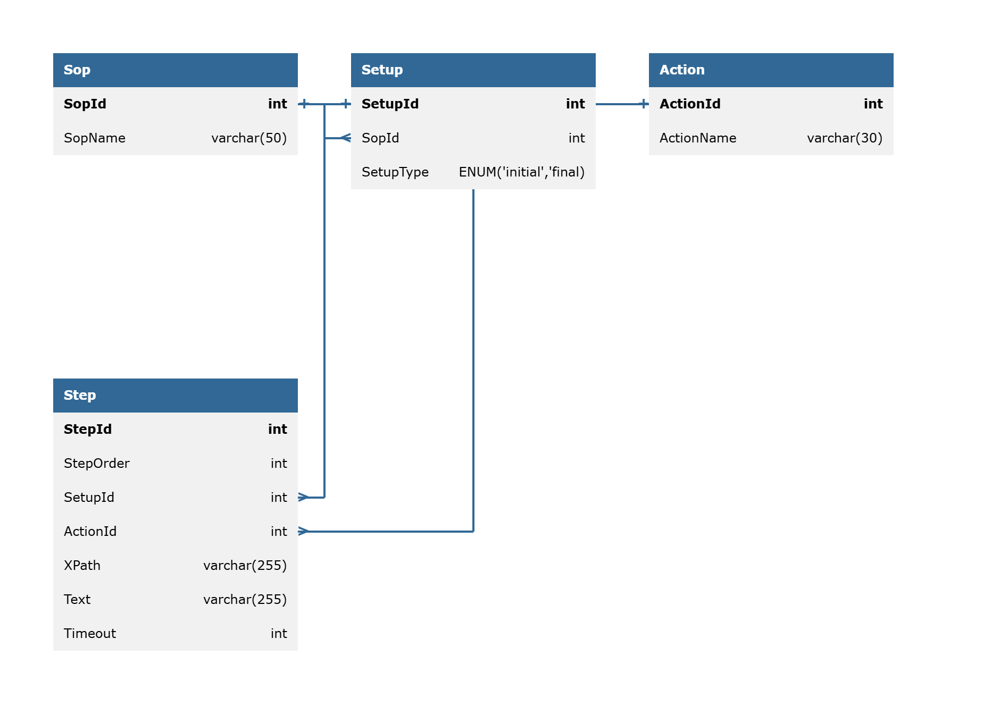

ERDL:

Sop  
-  
SopId int PK  
SopName varchar(50)  

Setup  
-  
SetupId int PK
SopId int FK > Sop.SopId  
SetupType ENUM('initial','final)  

Action  
-  
ActionId int PK  
ActionName varchar(30)  

Step  
-  
StepId int PK  
StepOrder int  
SetupId int FK > Setup.SetupId
ActionId int FK > Action.ActionId  
XPath varchar(255)  
Text varchar(255)  
Timeout int  

