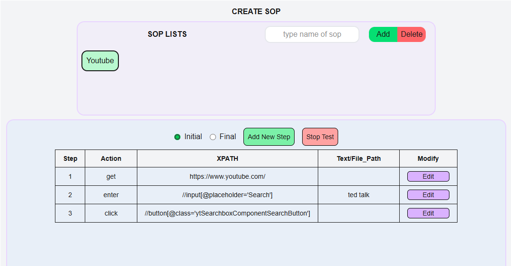
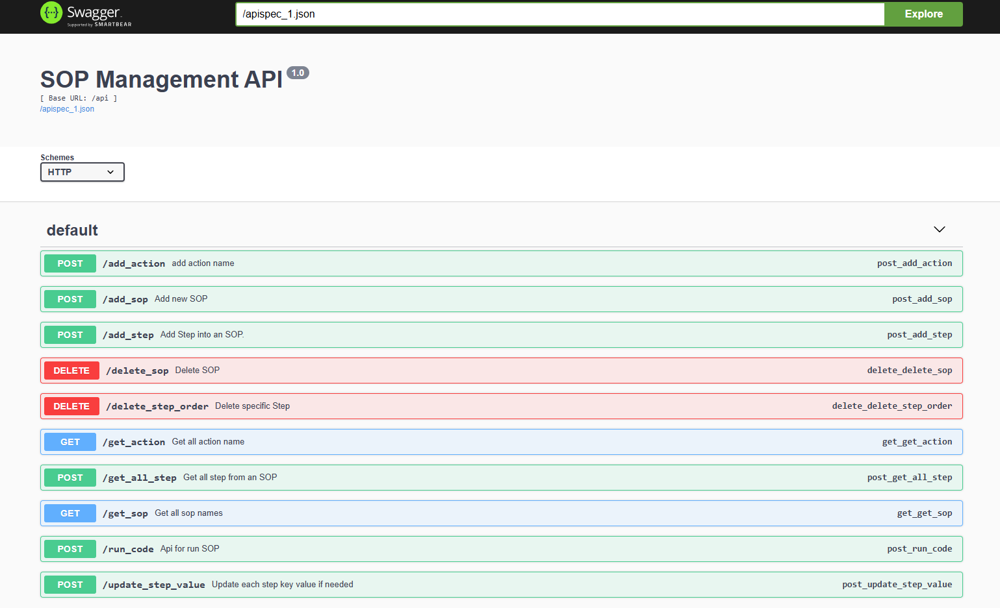
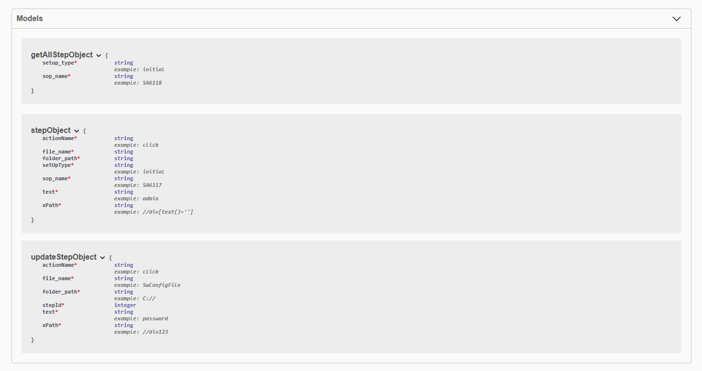

# Automate Configurator App

A web application that automates the setup of development environments using Python and Next.js.  
The backend leverages Python (Flask + Selenium), and the frontend is built with Next.js for a modern user interface.

---

## Table of Contents
- [Installation](#installation)
- [Usage](#usage)
- [Project Structure](#project-structure)
- [Demo](#demo)

---

## Installation

### 1. Clone the repository

```bash
git clone https://github.com/ANHVU280598/Selenium_project.git
cd Selenium_project
```
### 2. Install back end
```bash
cd back_end
python -m venv venv
# On Windows
venv\Scripts\activate
# On macOS/Linux
source venv/bin/activate
pip install -r requirements.txt
```
### 3. Install front end
```bash
cd front_end
npm install
```

## Usage
### 1. Run Front End (Next.Js)
```bash
cd front_end
npm next dev
http://localhost:3000 — This is the main user interface for the application.
```

### 2. Run Back End (Flask, Selenium, Swagger)
```bash
cd back_end
# Activate virtual environment
venv\Scripts\activate     # Windows
# or
source venv/bin/activate  # Linux/macOS
# Run the app
python app.py data/automation_app.db

http://localhost:5000/api/docs — This opens the Swagger UI to explore available API endpoints.
```



## Project Structure
```bash
Selenium_project/
├── back_end/                          # Backend application using Flask + Selenium
│   ├── data/automation_app.db         # SQLite database used for automation storage
│   ├── support_function/              # Python helper scripts for browser automation
│   │   ├── __init__.py                # Marks directory as a Python module
│   │   ├── Helper.py                  # Contains reusable helper functions
│   │   └── Load_Driver.py             # Logic to load Selenium WebDriver
│   ├── swagger/                       # OpenAPI specification for backend APIs
│   │   └── full_api.yml               # YAML file describing API endpoints
│   ├── venv/                          # Python virtual environment (should be gitignored)
│   ├── app.py                         # Main Flask application entry point
│   ├── db.py                          # Database connection and ORM logic
│   ├── initdb.py                      # Script to initialize the database
│   ├── runCode.py                     # Executes automation code logic
│   └── requirements.txt               # Python dependencies
│
├── front_end/                         # Frontend application using Next.js + TypeScript
│   ├── app/                           # App-level layout and styles
│   │   ├── global.css                 # Global CSS styling
│   │   ├── layout.tsx                 # Main layout wrapper for pages
│   │   └── page.tsx                   # Root landing page
│   ├── components/                    # Reusable UI components
│   │   ├── Action_Menu.tsx            # Dropdown for user actions
│   │   ├── Display_Automation_Code.tsx # Displays generated automation code
│   │   ├── Display_Automation.tsx     # Shows list of automations
│   │   ├── Display_SopName.tsx        # Shows SOP name selection
│   │   ├── Text_Menu.tsx              # Menu for entering plain text input
│   │   └── Xpath_Menu.tsx             # Menu for configuring XPath values
│   └── store/                         # Redux-based state management
│       ├── hooks.ts                   # Custom hooks for using Redux store
│       ├── provider.tsx               # Redux provider wrapper
│       ├── sopSlice.ts                # State slice for SOP data
│       ├── StepSlice.ts               # State slice for step data
│       └── store.ts                   # Store configuration
│
└── README.md                          # Project documentation

```              
## Demo Video

👉 Watch the demo here: [YouTube Video](https://youtu.be/3eHyZe9wde4)
